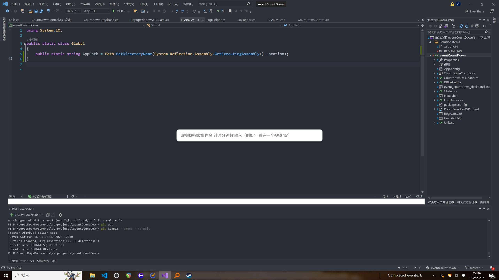

## 界面




## 进度
已经完成最简单的基本功能，UI也还看的下去，需要添加一些自定义选项，以及改进UI

## 目标

### UI优化
- 试试能不能把popupWindow的UI用WPF控件去写，太丑了 ✅

### 功能实现
- 选项菜单
	- 右键弹出选项
	- 自定义快捷键
	- 计时结束叮~ ✅
		- 暂时先调了win的systemSound，后续implement自定义音效 ✅
	- i18n（？）有必要的话……
- 自定义字体
	- 包括默认fallback字体设置
- 数据库啦数据库！✅
- 提供自定义API接口
- 数据库数据可视化（或许用插件形式？）
- 数据库数据查看和编辑（先用SQLite online viewer吧）

### 细节改进
- 刚开始的时候不要显示假数据啦，就显示Completed events ✅
- 现在俩区块已经是定长了，也确定不好改变长度了……看看能不能用缩小字体或者设置maxsize，多出的用省略号表示的方法去美化一下 ✅
- 改进写死的值，用屏幕尺寸的比例去做优化 - gitignore ✅

### bugFix
- 有时无法正确获得焦点

### 版本分支
在commit `99e26e` 的基础上延伸出不带数据库的版本的branch——只是快速添加一个倒计时然后显示它
	- 加上提示音

## 使用场景
对于因为没有时间感而导致的执行力差的人（我）或许有奇效。没人催就做不了事那就自己催自己！每时每刻都接近ddl（

不是滴答清单之类的OTD的代替品，但是起因是真的很喜欢滴答清单的快捷键添加任务，以及 Mac 的dock显示。
keep it simple。它不是任务管理工具。任务依旧使用你喜欢的任务管理工具去拆分和管理。
它只是一个轻量的……时间提醒，或者微型ddl？带即时激励的那种。

场景如：
- 看到个好玩的想看一下但是明明有正事要干！不行不行，但是又纠结想看……设置时间就好！
- 看到很有价值的教程想看但是望而生畏！总觉得要花很多时间……设置时间就好！就算中途看不下去了，看看剩余时间就可以安慰自己，再坚持这么长就OK了！不会永无尽头！
- 一天不知道怎么就过去了！要干什么之前设置时间就好！

总之重点就是一个字，轻！（虽然好像随着SQLite加进来已经不那么轻了但是用着感觉轻就是轻！
很多时候执行力差，无法提起精神做什么事情，做到一半走神玩手机去了，或者根本无法开始……其实都和糟糕的时间感有关系。因为时间感差所以感觉不到事情的紧迫，无法好好安排时间、往往低估做某些事需要的时间、高估另外一些事情需要的时间……两者都会导致拖延。哪怕是最简单的“在任务清单上加上一个任务”的事情，也会成为一个大大的绊脚石。所以要尽可能减少“开始”这件事情的心理负担。这种时候它就能派上用场啦！

## 使用方法
### 安装
管理员权限运行`install.bat`

### 使用
- `ctrl shift d` 新建倒计时。在弹出窗口中按照`事件 时间（单位为min）`格式输入后按回车，就会添加一个事件并倒计时输入的时间。
- 可以在现有事件还没结束时添加新事件。如果现有事件持续时间没有超过一分钟，不计入数据
- 按 `Esc` 取消添加

### 自定义提示音
把**wav文件**拖进程序文件夹，重命名为`Sound.wav`即可

### 卸载
管理员权限运行`uninstall.bat`

### 版本
commit `99e26e` 是不带数据库的最简洁版本

## 文件结构

- `CountDownControl.cs`：DeskBand Interface， 主文件
- `countdownDeskband.cs`: DeskBand Server， 不用动
- `popupWindowWPF.xaml`: popup Window 的界面和逻辑
- `Global.cs`：存放一些全局变量（后续可能放到ini里的东西）
- `LogHelper.cs`：log辅助类
- `DBHelper.cs`：数据库辅助类
- `Utils.cs`：工具辅助类
## 自编译注意事项
需要签名。如果需要添加第三方依赖，也需要带签名的第三方依赖
```
For the project to be able to be registered, it will need to have a strong name, which means it will need to be signed. Open the project properties, go to the 'Signing' section and choose 'Sign the Assembly'.
(https://github.com/dwmkerr/sharpshell/blob/main/docs/extensions/deskband/deskband.md)
```

## Thanks
- [sharpshell](https://github.com/dwmkerr/sharpshell)
- [Dapper.StrongName](https://github.com/DapperLib/Dapper)

